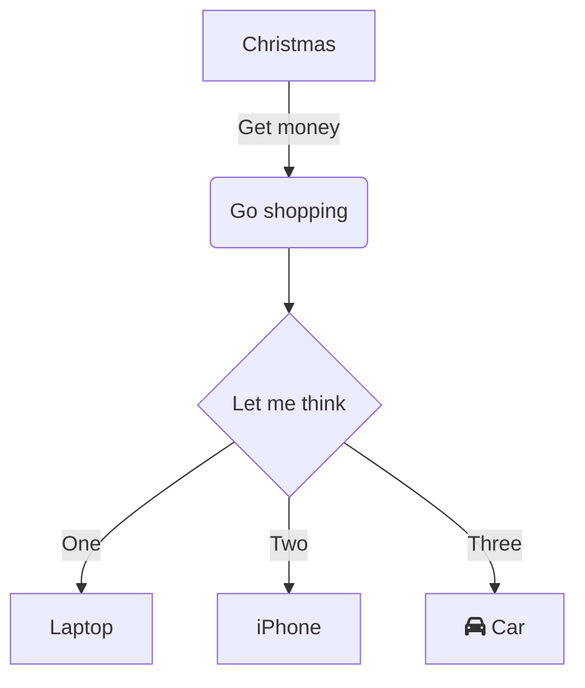

| Title         | Форматирование          |
| ------------- | ----------------------- |
| Creation Date | 2023-01-05              |
| Type          | #Meta                   |
| Status        | #Meta/Status/InProgress |
| Tags          | #Meta/Formatting        |
https://help.obsidian.md/Editing+and+formatting/Basic+formatting+syntax
## Внутренние ссылки

```md
[[Index|Индекс]]
```
[[Index|Индекс]]

---
## Вложеннные файлы
```md
![[Правила ведения заметок]]
```
![[Правила ведения заметок]]

---

## Заголовки

```nd
# Заголовок1
## Заголовок2
### Заголовок3
#### Заголовок4
```

# Заголовок1
## Заголовок2
### Заголовок3
#### Заголовок4

---
## Callouts

https://help.obsidian.md/Editing+and+formatting/Callouts

> [!error]- Error Header
> Error text Error text Error text Error text Error text Error text 
> Error text Error text Error text Error text Error text Error text 
> Error text Error text Error text Error text Error text Error text 
> [!hint]- Hint Header
> Hint text

> [!info]- Info Header
> Info text

> [!hint]- Hint Header
> Hint text

> [!todo] Task Header
> - [x] Task text

> [!help] Help Header
> Help text

> [!question] Can callouts be nested?
> > [!todo] Yes!, they can. 
> > > [!example] You can even use multiple layers of nesting.

---
> Текст Текст Текст Текст Текст Текст Текст Текст Текст Текст Текст Текст Текст Текст Текст Текст Текст Текст Текст Текст Текст Текст Текст Текст Текст Текст Текст Текст Текст Текст Текст Текст Текст Текст Текст Текст 

	Текст Текст Текст Текст Текст Текст Текст Текст Текст Текст Текст Текст Текст Текст Текст Текст Текст Текст Текст Текст Текст Текст Текст Текст Текст Текст Текст Текст Текст Текст Текст Текст Текст Текст Текст Текст 



### Ccылки
https://help.obsidian.md/Linking+notes+and+files/Internal+links

### Задачи
#### [Запрос задач из текущей заметки](https://publish.obsidian.md/tasks/How+To/How+to+get+tasks+in+current+file#Putting+it+in+to+a+callout%2C+for+prettier+output)
##### Раздел с задачей
- [ ] Сделать... (попадет в запрос ниже)
```dataviewjs
function callout(text, type) {
    const allText = `> [!${type}]\n` + text;
    const lines = allText.split('\n');
    return lines.join('\n> ') + '\n'
}

const query = `
not done
path includes ${dv.current().file.path}
# you can add any number of extra Tasks instructions, for example:
group by heading
`;

dv.paragraph(callout('```tasks\n' + query + '\n```', 'todo'));
```
